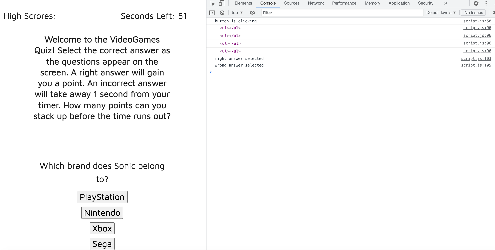

# Code-Quiz

As a user, I want a video games quiz that will test my knowledge on the industry with random, topic-related questions so that I can learn more and improve my skills.

Deployed Application: [Password Generator](https://florenciab94.github.io/Code-Quiz/)

## Installation

To look at the project, follow GitHub's instructions on how to clone a repository to your computer here:
[Cloning a Repository](https://docs.github.com/en/github/creating-cloning-and-archiving-repositories/cloning-a-repository-from-github/cloning-a-repository "GitHub's guide to cloning a repository")

# Credits

[W3 Schools](https://w3schools.com/)
[MDN Web Docs](https://developer.mozilla.org/en-US/)

## License

[MIT](https://choosealicense.com/licenses/mit/)
